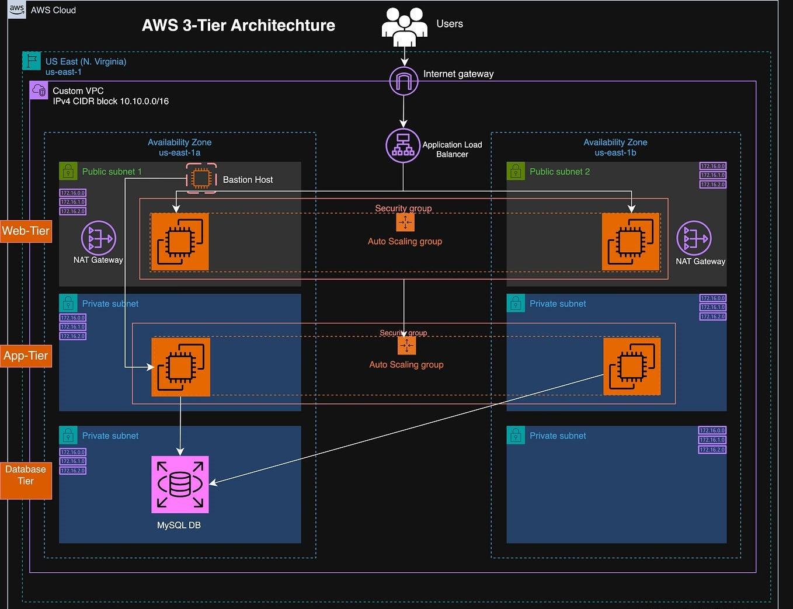

# 3Tier Artitecture with Load Balancers & AutoScaling
## Description:
#### A hands-on implementation of a 3-Tier Web Architecture on AWS, featuring EC2, RDS, and Load Balancers for secure, scalable, and high-availability deployment.
## Architecture Overview:

#### In this architecture:
- **Web Tier**(Frontend):
Handles the user interface and interactions. Receives requests from the ALB and forwards them to the Application Tier.
- **Application Tier** (Backend):
Processes business logic. Receives requests from the Web Tier via an internal load balancer and communicates with the Database for data operations.
- **Database Tier** (Data Layer):
Uses Amazon RDS MySQL for secure, persistent data storage. Located in private subnets to ensure data security and reliability.
## What is a 3-Tier Architecture?
#### Three-tier architecture is a software design pattern that separates an application into three layers: the Presentation Layer (frontend) handles the user interface and interactions, the Application Layer (backend) processes business logic and communicates between the frontend and the database, and the Data Layer (database) securely stores and retrieves application data. This separation of concerns improves scalability, maintainability, and security, allowing each layer to be developed, updated, and scaled independently.
## Benefits of 3-Tier Architecture
- **Separation of Concerns:** Each layer has a distinct responsibility, making development and maintenance easier.
- **Scalability:** Layers can be scaled independently to handle increased load.
- **Security:** Database and sensitive data are isolated from direct user access.
- **Maintainability:** Changes or updates in one layer do not affect the others.
- **Reliability & Flexibility:** Faults in one layer do not bring down the entire system, and layers can be updated independently.
## Let's Create ⚡
## Step-1: Create VPC
1. Go to VPC → Create VPC
2. Name: three-tier-vpc
3. IPv4 CIDR block: 10.0.0.0/16
4. Click create vpc

## Step-2: Create Subnets
#### Create 8 Subnets-
 - 2 Public Subnet.
  - 2 Private subnets for Webtier.
 - 2 subnets for Apptier.
 - 2 subnets for dbtier. 
 #### Steps
 1. Go to Subnets → Create Subnet
2. Select your VPC (three-tier-vpc)
#### Public Subnet:
1. Subnet 1 → Name: PublicSubnetZoneA → AZ: ap-south-1a → CIDR: 10.0.0.0/20
2. Subnet 2 → Name: PublicSubnetZoneB → AZ: ap-south-1b → CIDR:  10.0.16.0/20
#### Private Subnet:
1. Subnet 3 → Name: WebSubnetZoneA-
 → AZ: ap-south-1a → CIDR: 10.0.32.0/20
2. Subnet 4 → Name:WebSubnetZoneB  → AZ: ap-south-1b → CIDR: 10.0.48.0/20
3. Subnet 4 → Name: AppSubnetZoneA → AZ: ap-south-1a → CIDR: 10.0.64.0/20
4. Subnet 4 → Name: AppSubnetZoneB → AZ: ap-south-1b → CIDR: 10.0.80.0/20
5. Subnet 4 → Name: DBSubnetZoneA→ AZ: ap-south-1a → CIDR: 10.0.96.0/20
6. Subnet 4 → Name: DBSubnetZoneB→ AZ: ap-south-1b → CIDR: 10.0.112.0/20

Click Create Subnets

## Step - 3: Create Route Tables
#### Create Two Route Tables - Public Route Table and Private Route Table

1.Create Internet Gateway and Attach to the VPC.

2.Add route of Internet Gateway in Public Route Table

## Step 4- Create RDS(Mysql) Database

#### Steps to Create MySQL RDS Database

1. Go to AWS RDS Console and click Create Database.

2. Choose Standard Create and select MySQL engine.

3. Pick Free Tier template for testing.

4. Enter DB Instance Identifier, Master Username, and a strong Password.

5. Select Instance Class (e.g., db.t3.micro) and storage (20GB default).

6. Under Connectivity, select your VPC and attach a Security Group allowing port 3306.

7. Click Create Database and wait until it shows Available.
## Step 5- Launch Ec2 Instances

#### Steps
#### 1. Lauch JumpServer in public Subnet for ssh to RDS.
- Install Mariadb
- Create Database and Table
1. sudo yum install mariadb-server105 -y
2. sudo mysql -u admin -p
#### 2.Lauch Appserver in Public Subnet
- Install Nginx, php and php-mysql connector
- Start and enable nginx and php-fpm
1. sudo yum install nginx php -y
2. sudo service nginx start
3. sudo systemctl enable nginx
4. sudo service php-fpm start
5. sudo systemctl enable php-fpm
6. sudo yum install mysql-php8.4.x86_64

#### 3.Launch WebServer in Public Subnet
- Install nginx and enable
 1. sudo yum install nginx -y
 2. sudo service nginx start
 3. sudo systemctl enable nginx
## Step 6 - Get AMI
####  Create AMI(Amazon Machine Image) of Webserver and Appserver for AutoSCaling

## Step 7 - Create Autoscaling
#### Create auto scaling for webtier and apptier.
1.Launch Template for Webtier and Apptier

2.Create Auto Scaling Group

- Mimimum- 1
- Maximum - 4
- Desire - 1

## Step 8- Create Load Balancer Target group
#### Create Target Groups for webtier and Apptier

## Step 9- Create Load Balancer

## Conclusion
#### This application follows a 3-tier architecture, which means it separates the user interface, the business logic, and the data storage into three independent layers. This makes the app easier to maintain, more secure, and allows each part to be updated or scaled without affecting the others. Using this structure also helps the application run smoothly in cloud environments like AWS, making it more reliable and flexible for future growth.
